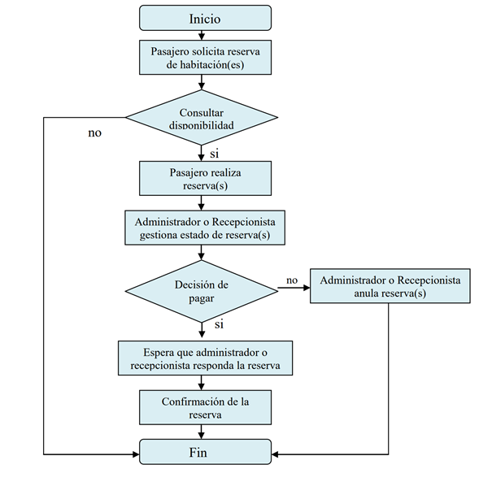

# TL;DR

El proceso de reserva comienza desde la PWA* realizando una solicitud de habitaciones según su disponibilidad, de acuerdo con el resultado de una consulta realizada a las habitaciones disponibles el CLIENTE* realiza la reserva según sus necesidades y requerimientos, dentro de las opciones que podrá observar el CLIENTE tendrá diferentes servicios que podrá agregar a lo que desea adquirir en su reserva, el sistema realizará diferentes validaciones que le darán al CLIENTE la seguridad que todo los requerimientos seleccionados están disponibles y los detalles necesarios, antes de la confirmación del pago, el CLIENTE deberá realizar un registro o un ingreso a su cuenta, esto con el objetivo de tener los datos básicos necesarios para realizar la reserva, como nombre, documento de identidad, correo electrónico de contacto y teléfono de contacto, adicionales a los otros datos posiblemente requeridos, al momento de realizar un login y de confirmar se realizará una reserva “provisional” de aproximadamente 20 minutos que tendrá el CLIENTE para realizar los pagos necesarios, al recibir la confirmación del pago el sistema le otorgará al CLIENTE el resumen actualizado de su reserva, con las opciones de imprimir o un QR para su posterior lectura y validación en las instalaciones, adicional se enviará un correo electrónico pasado estos 20 minutos si el sistema no recibe la confirmación del pago de parte del CLIENTE se volverá a poner como disponible los recursos que se habían previamente seleccionado

# Motivación

Definir flujo de agendamiento para los clientes al ingresar a la web

# Propuesta de implementación

# Métricas

W.I.P

# Riesgos e inconvenientes

W.I.P

# Alternativas

W.I.P

# Impacto potencial y dependencias

W.I.P

# Preguntas sin resolver

W.I.P

# Conclusión

# Team

Jassen Cristian Castillo Espinoza

Juan Sebastian Calle Loaiza

# Template from

https://github.com/buritica/mgt/blob/master/es/template-de-rfcs.md